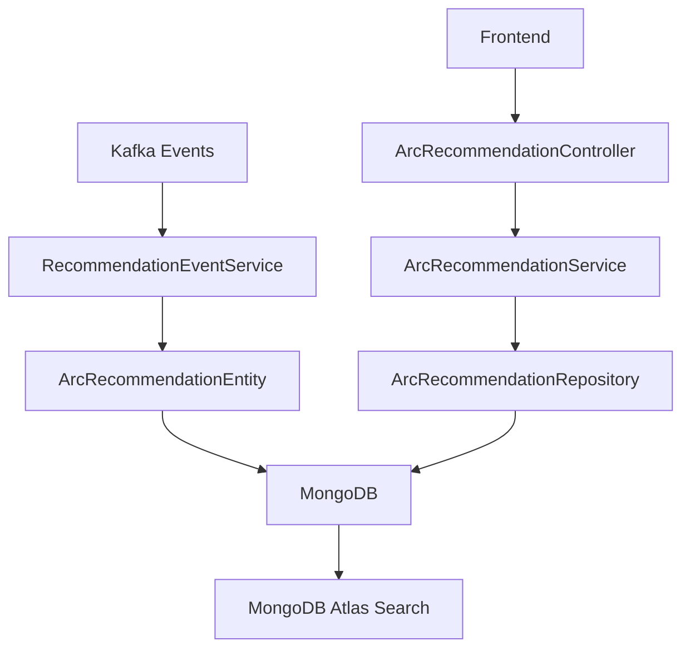

# Recommendation Features - Complete Analysis

## Overview
This document provides a comprehensive analysis of the recommendation features in the AGCS Risk Assessment application, covering the complete end-to-end implementation from backend data processing to frontend user interaction.

## Table of Contents
1. [Architecture Overview](#architecture-overview)
2. [Backend Implementation](#backend-implementation)
3. [Frontend Implementation](#frontend-implementation)
4. [Data Flow](#data-flow)
5. [Key Features](#key-features)
6. [Technology Stack](#technology-stack)
7. [API Specifications](#api-specifications)
8. [Database Schema](#database-schema)
9. [Security Implementation](#security-implementation)
10. [Performance Considerations](#performance-considerations)

## Architecture Overview

The recommendation system follows a microservices architecture with event-driven data ingestion and RESTful API consumption:



## Backend Implementation

### 1. Controllers & API Endpoints

#### **ArcRecommendationController**
```java
@RestController
@RequestMapping(value = "${application.rest.context-path:/api}/arcRecommendation")
public class ArcRecommendationController
```

**Endpoints:**
- `POST /api/arcRecommendation/list` - Search recommendations with filtering/pagination
- `GET /api/arcRecommendation/{id}` - Get detailed recommendation by ID

**Key Features:**
- Submission-based authorization via `@SubmissionAuthorization`
- Requires `submission-id` header for all requests
- JSON request/response handling
- Swagger documentation integration

### 2. Service Layer

#### **ArcRecommendationService Interface**
```java
public interface ArcRecommendationService {
    SearchRecommendationResponse searchRecommendation(String submissionId, RecommendationListFilterRequest request);
    GetRecommendationDetailResponse getRecommendationDetail(String id);
}
```

#### **ArcRecommendationServiceImpl**
- Implements business logic for recommendation operations
- Handles submission ID extraction using `SubmissionUtil.extractSubmissionBaseNo()`
- Orchestrates repository calls and data mapping
- Implements error handling with custom exceptions

### 3. Data Access Layer

#### **ArcRecommendationRepository**
```java
@Repository
public interface ArcRecommendationRepository extends MongoRepository<ArcRecommendationEntity, String> {
    ArcRecommendationEntity findByRecommendationId(String recommendationId);
}
```

#### **ArcRecommendationRepositoryCustom**
```java
@Repository
public interface ArcRecommendationRepositoryCustom {
    List<ArcRecommendationEntity> findArcRecommendationsByAtlas(String submissionId, RecommendationListFilterRequest request);
    int countTotalAmountOfArcRecommendationsByAtlas(String submissionBaseNo, RecommendationListFilterRequest request);
}
```

**Implementation Features:**
- **MongoDB Aggregation Pipeline** with search, match, and sort stages
- **AgGridToMongoFilterHelper** converts frontend filters to MongoDB queries
- **Atlas Search Integration** for text-based searching
- **Complex filtering** supporting text, date, number, and set filters

### 4. Entity Model

#### **ArcRecommendationEntity**
```java
@Document(collection = "arcRecommendation")
public class ArcRecommendationEntity extends AuditEntity {
    @Id private String id;
    @Indexed(name = "recommendationId_idx", unique = true)
    private String recommendationId;
    
    // Core recommendation data
    private String recommendationTitle;
    private String recommendationBody;
    private String recommendationType;
    private String recommendationCategory;
    private String recommendationPriority;
    private String recommendationStatus;
    
    // Financial data
    private BigDecimal lossEstimateBeforeValue;
    private BigDecimal lossEstimateAfterValue;
    private String currency;
    
    // Timeline data
    private LocalDate dueDate;
    private LocalDate recommendationCompletedDate;
    private BigDecimal probabilityOfCompliance;
    
    // Relationships
    private String objectId;
    private String objectName;
    private String submissionId;
    private String submissionBaseNr;
    private String rcId;
    
    // Metadata
    private User assignedEngineer;
    private String sourceOfRecommendation;
    private String recommendationNotes;
    // ... additional fields
}
```

### 5. Event-Driven Data Processing

#### **RecommendationEventService**
- Processes Kafka events containing recommendation data
- Validates incoming events using `RcIdValidator`
- Creates new or updates existing recommendations
- Resolves object names from location entities
- Implements error handling and logging

**Event Processing Flow:**
1. Receive `RecommendationEventDataDTO` from Kafka
2. Validate event structure and RcID format
3. Check if assessment exists in local database
4. Resolve object name from location entities
5. Create or update recommendation entity
6. Save to MongoDB

### 6. Filterable Fields
```java
public enum RecommendationListFilterField {
    OBJECT_ID, OBJECT_NAME, RECOMMENDATION_TITLE,
    RECOMMENDATION_TYPE, RECOMMENDATION_CATEGORY,
    RECOMMENDATION_STATUS, RECOMMENDATION_PRIORITY,
    RECOMMENDATION_COMPLETED_DATE, DUE_DATE,
    LOSS_ESTIMATE_BEFORE_VALUE, LOSS_ESTIMATE_AFTER_VALUE
}
```

## Frontend Implementation

### 1. Architecture

The frontend uses Angular with NGXS state management and AG Grid for data presentation:

```
Pages/
├── RecommendationPageComponent (Main container)
├── RecommendationTableComponent (AG Grid)
└── RecommendationDetailsModalComponent (Detail view)

State/
├── RecommendationState (NGXS state management)
├── RecommendationActions
└── RecommendationFacade

Services/
└── ArcRequestService (HTTP client)
```

### 2. State Management (NGXS)

#### **RecommendationState**
```typescript
export interface RecommendationStateModel {
  isNoRecommendationList: boolean;
  showRecommendationTable: boolean;
  recommendationList: { rows: RecommendationDTO[]; lastRow: number };
  recommendationDetail: RecommendationDTO | null;
  totalRecommendations: number;
}
```

#### **Actions**
- `Search` - Search recommendations with filters
- `SearchAll` - Check if recommendations exist
- `GetRecommendationDetail` - Get individual recommendation
- `ResetRecommendationDetail` - Clear detail state
- `SetShowRecommendationTable` - Toggle table visibility

### 3. Components

#### **RecommendationTableComponent**
- **AG Grid Enterprise** with advanced features
- **Column Definitions**: 11 columns with various filter types
- **Filter Types**: Text, Number, Date, Set filters
- **Cell Renderers**: Badge renderer for status/priority
- **Row Interactions**: Click to open detail modal
- **Pagination**: Server-side pagination
- **Sorting**: Multi-column sorting

#### **RecommendationDetailsModalComponent**
- **Full-screen modal** for detailed view
- **Displays all recommendation fields**
- **Date formatting** with localization
- **Status/Priority badges** with color coding
- **Responsive design**

### 4. Data Models

#### **RecommendationDTO**
```typescript
export interface RecommendationDTO {
  id: string;
  rcId: string;
  objectId: string;
  objectName: string;
  recommendationId: string;
  recommendationGUId: string;
  recommendationStatus: string;
  recommendationPriority: string;
  recommendationTitle: string;
  recommendationBody: string;
  recommendationType: string;
  recommendationCategory: string;
  lossEstimateBeforeValue: number;
  lossEstimateAfterValue: number;
  dueDate: string | Date;
  recommendationCompletedDate: string | Date;
  lastModifiedDate: string | Date;
  currency: string;
}
```

### 5. Enums & Constants

#### **RecommendationTypeEnum**
- TO_BE_VALIDATED_NOT_REQUIRED
- HUMAN_ELEMENT
- PHYSICAL
- OTHER_PERILS

#### **RecommendationCategoryEnum**
40+ categories including:
- HOUSEKEEPING
- HOT_WORK
- AUTOMATIC_SPRINKLERS
- FIRE_DOOR_INSPECT_TEST_DEFICIENCIES
- etc.

#### **RecommendationPriorityEnum**
- HIGH_PRIORITY (Critical - Red)
- IMPORTANT (Positive - Green)
- ADVISORY (Active - Blue)

#### **RecommendationStatusEnum**
- OPEN
- IN_PROGRESS
- REPORTEDLY_COMPLETED
- COMPLETED_CONFIRMED
- NOT_AGREED
- DEFERRED
- NO_LONGER_APPLICABLE

## Data Flow

### 1. Inbound Data Flow (Kafka Events)
```
LC360 System → Kafka Topic → RecommendationEventService → Validation → 
Database Lookup → Entity Mapping → MongoDB Storage
```

### 2. Search Flow
```
Frontend Grid Filter → HTTP Request → Controller → Service → 
Repository → MongoDB Atlas Search → Aggregation Pipeline → Response
```

### 3. Detail Flow
```
Row Click → Frontend Action → HTTP Request → Controller → 
Service → Repository → MongoDB Query → Entity → Response → Modal
```

## Key Features

### 1. Advanced Search & Filtering
- **Text Search**: Uses MongoDB Atlas Search for recommendation titles
- **Date Filtering**: Date range filtering for due dates and completion dates
- **Number Filtering**: Range filtering for financial estimates
- **Set Filtering**: Multi-select for status, priority, type, category
- **Combined Filters**: Multiple filter types can be applied simultaneously

### 2. Pagination & Sorting
- **Server-side pagination** with configurable page sizes
- **Multi-column sorting** with priority ordering
- **Large dataset handling** with efficient MongoDB queries

### 3. Data Visualization
- **Color-coded badges** for status and priority
- **Responsive grid layout**
- **Financial data formatting** with currency support
- **Date localization**

### 4. Authorization & Security
- **Submission-based access control**
- **Multi-tenant data isolation**
- **Header-based authentication**

## Technology Stack

### Backend
- **Spring Boot** - Framework
- **MongoDB** - Database
- **MongoDB Atlas Search** - Text search functionality
- **Apache Kafka** - Event streaming
- **MapStruct** - Entity mapping
- **Jackson** - JSON serialization

### Frontend
- **Angular** - Framework
- **NGXS** - State management
- **AG Grid Enterprise** - Data grid
- **RxJS** - Reactive programming
- **TypeScript** - Language

## API Specifications

### POST /api/arcRecommendation/list

**Request:**
```json
{
  "startRow": 0,
  "endRow": 100,
  "sortModel": [
    { "colId": "recommendationTitle", "sort": "asc" }
  ],
  "filterModel": {
    "recommendationStatus": {
      "filterType": "set",
      "values": ["OPEN", "IN_PROGRESS"]
    },
    "dueDate": {
      "filterType": "date",
      "dateFrom": "2025-01-01",
      "dateTo": "2025-12-31"
    }
  }
}
```

**Response:**
```json
{
  "rows": [
    {
      "id": "507f1f77bcf86cd799439011",
      "objectId": "DEU1752636069016401",
      "objectName": "Test Location",
      "recommendationTitle": "Install Fire Suppression System",
      "recommendationType": "PHYSICAL",
      "recommendationCategory": "AUTOMATIC_SPRINKLERS",
      "recommendationStatus": "OPEN",
      "recommendationPriority": "HIGH_PRIORITY",
      "dueDate": "2025-12-31",
      "currency": "EUR",
      "lossEstimateBeforeValue": 1000000.00,
      "lossEstimateAfterValue": 250000.00
    }
  ],
  "lastRow": 1
}
```

### GET /api/arcRecommendation/{id}

**Response:**
```json
{
  "id": "507f1f77bcf86cd799439011",
  "rcId": "RC123456789",
  "currency": "EUR",
  "objectId": "DEU1752636069016401",
  "objectName": "Manufacturing Plant A",
  "recommendationId": "REC_2025_001",
  "recommendationGUId": "a1b2c3d4-e5f6-7890-abcd-ef1234567890",
  "recommendationStatus": "OPEN",
  "recommendationPriority": "HIGH_PRIORITY",
  "recommendationTitle": "Install Automatic Sprinkler System",
  "recommendationBody": "Install comprehensive automatic sprinkler system...",
  "recommendationType": "PHYSICAL",
  "recommendationCategory": "AUTOMATIC_SPRINKLERS",
  "lossEstimateBeforeValue": 1000000.00,
  "lossEstimateAfterValue": 250000.00,
  "dueDate": "2025-12-31",
  "recommendationCompletedDate": null,
  "lastModifiedDate": "2025-01-20T10:30:00Z"
}
```

## Database Schema

### MongoDB Collection: `arcRecommendation`

```javascript
{
  "_id": ObjectId("507f1f77bcf86cd799439011"),
  "recommendationId": "REC_2025_001", // Indexed (unique)
  "recommendationTitle": "Install Automatic Sprinkler System",
  "recommendationBody": "Detailed recommendation description...",
  "recommendationType": "PHYSICAL",
  "recommendationCategory": "AUTOMATIC_SPRINKLERS",
  "recommendationPriority": "HIGH_PRIORITY",
  "recommendationStatus": "OPEN",
  "lossEstimateBeforeValue": NumberDecimal("1000000.00"),
  "lossEstimateAfterValue": NumberDecimal("250000.00"),
  "currency": "EUR",
  "dueDate": ISODate("2025-12-31T00:00:00Z"),
  "recommendationCompletedDate": null,
  "probabilityOfCompliance": NumberDecimal("0.85"),
  "objectId": "DEU1752636069016401",
  "objectName": "Manufacturing Plant A",
  "submissionId": "SUB123456789",
  "submissionBaseNr": "SUB123456",
  "rcId": "RC123456789",
  "assignedEngineer": {
    "id": "ENG001",
    "name": "John Doe"
  },
  "sourceOfRecommendation": "RISK_ASSESSMENT",
  "recommendationNotes": "Additional notes...",
  "createdDate": ISODate("2025-01-15T09:00:00Z"),
  "lastModifiedDate": ISODate("2025-01-20T10:30:00Z"),
  "createdBy": "system",
  "lastModifiedBy": "john.doe"
}
```

### Indexes
- `recommendationId_idx` (unique)
- `submissionBaseNr_idx`
- `objectId_idx`
- `rcId_idx`
- Atlas Search Index for text search functionality

## Security Implementation

### 1. Authorization
- **@SubmissionAuthorization** annotation on all endpoints
- **submission-id header** validation
- **Multi-tenant isolation** by submission base number

### 2. Data Access Control
- Users can only access recommendations for their submissions
- **Repository filtering** by submission base number
- **Cross-submission data leakage prevention**

### 3. Input Validation
- **Request validation** using Bean Validation
- **Filter parameter sanitization**
- **SQL/NoSQL injection prevention**

## Performance Considerations

### 1. Database Optimization
- **MongoDB Atlas Search** for efficient text searching
- **Aggregation pipeline optimization**
- **Proper indexing strategy**
- **Connection pooling**

### 2. Frontend Optimization
- **Server-side pagination** to handle large datasets
- **Lazy loading** of recommendation details
- **State management** to cache frequently accessed data
- **AG Grid virtualization** for large result sets

### 3. Caching Strategy
- **Frontend state caching** for search results
- **HTTP response caching** where appropriate
- **Database query optimization**

## Integration Points

### 1. External Systems
- **LC360** - Source of recommendation events via Kafka
- **Location Service** - Object name resolution
- **Assessment Service** - RcID validation

### 2. Internal Services
- **Submission Service** - Authorization validation
- **User Service** - Engineer assignment
- **Audit Service** - Change tracking

## Error Handling

### 1. Backend Error Handling
- **Custom ServiceException** for business logic errors
- **Global Exception Handler** for consistent error responses
- **Validation error handling**
- **Database connection error handling**

### 2. Frontend Error Handling
- **State-based error management**
- **User-friendly error messages**
- **Retry mechanisms**
- **Fallback UI states**

## Monitoring & Observability

### 1. Logging
- **Structured logging** with correlation IDs
- **Performance logging** for slow queries
- **Error logging** with context
- **Audit logging** for data changes

### 2. Metrics
- **API response times**
- **Database query performance**
- **Error rates**
- **User interaction metrics**

## Future Enhancements

### 1. Planned Features
- **Real-time updates** via WebSocket
- **Bulk operations** for recommendation management
- **Advanced reporting** and analytics
- **Mobile optimization**

### 2. Technical Improvements
- **Performance optimization**
- **Enhanced search capabilities**
- **Better error handling**
- **Improved monitoring**

## Conclusion

The recommendation feature is a comprehensive, enterprise-grade system that provides:

- **Robust data processing** via Kafka events
- **Advanced search and filtering** using MongoDB Atlas Search
- **Rich user interface** with AG Grid Enterprise
- **Secure multi-tenant access control**
- **Scalable architecture** for large datasets
- **Complete audit trail** and error handling

The system successfully handles the complete lifecycle of recommendations from ingestion through user interaction, providing a solid foundation for risk assessment decision-making.